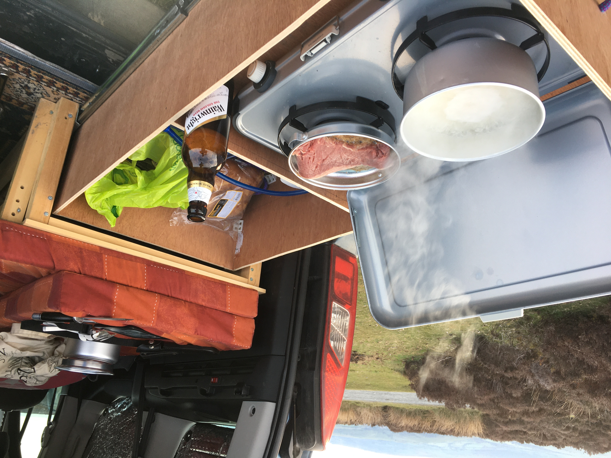

# Peugeot Partner Micro-camper Build

One of our cars was dying and we were looking for cheap but low mileage replacement. We live in the Lake District and enjoy a lot of outdoors activities (climbing, paraglding, kakaying, fell running etc.) so were attracted by a car that would behave like a van. After searching Autotrader we found a lot of Peugeot Partner MPVs (and Citroen Belingo's - which are the same vehicle rebadged) that had been disability converted. Typically, this meant low mileage and a low price - I think the target market tends to buy new due to subsidies and wanting peace of ming. A typical price is £4500 for less than 30,000 miles (e.g. [autotrader search]).

So, after a quick dash to Manchester I came back the proud owner of our new van:

These conversions tend to have only one rear seat (which is removable); a lowered floor and a heavy steel ramp with wheel chair ramp. The first job was to remove the winch paraphernalia and do something about the ramp. There were two possibilities: remove it completely and fill in the gap in the bumper; or lop it off with an angle grinder. The latter option was simpler (and more fun) and left me with a useful hatch to an underfloor storage compartment - once I'd fitted a new wooden floor. 

Cutting off the ramp...

The ramp removed leaving a large underfloor storage area with hatch:

The van isn't big so there's not much room for a bed/kitchen/living area we decided on a design with a bench that would pull out to a bed and a drawer to pull out a basic kitchen. As the rear door opens vertically and kind of forms a roof so that you get should shelter for cooking.

In this picture you can see the wooden floor put in over the original lowered floor and the frame for the bench and the start of the pull out section. When completed the bench and pull out section have alternating slats that make for a wide enough bed for two (just!)

We bought a memory foam 5" [mattress] cover from Amazon and cut it to size and into two bits - one for the bench seat and one for the bench back. The idea was to put them together to make the mattress when the bed is out

My Mother cleverly turned an old duvet into made-to-measure covers and adapted the original zipped cover to fit the new size - so that the two components were held together when in mattress mode

I built a wooden draw from plywood and fitted [drawer rails] to slide it under the bench. The rails are rated for 80kg load so the cooker/gas/utensils etc. are easily coped with

It works as quite a good cooking setup - at least when the weather is Ok...

For power I decided on using a Lithium Iron 'leisure battery' (not to be confused with a Lithium Ion) rather than a traditional lead-acid. The new technology is much lighter and can discharge and recharge to a much lower level than lead-acid. It's also a lot safer as I fitted it inside the van. I only went for 20Ah so that is small - although I was sent two by mistake so I could put in another in parallel ([LiFePo4 20Ah Lithium Battery]).

To charge the battery I bought a [Split Charge Relay Kit] and (with considerable trouble) routed this from the car battery back to the leisure battery in the passenger compartment. These relays charge the battery when the car is running. With only 20Ah the battery is recharged in about half an hour's driving.

The power is used for internal LED lighting ([12V 4 x LED Recessed Ceiling Light]); USB charging points the diesel heater and the cool-box fridge. Lights and USB etc. take negligible power but the heater start-up (which draws 7A) and the fridge take quite a lot of power. Given it's a micro-camper and we can recharge by driving a short way it didn't seem worth the expense of solar panels to give more power.

Here's the bed set up at dusk with the lights on inside.

For heating, I bought a [2KW 12V Air Diesel Heater] and fitted it into the underfloor space. The kit comes with an awkwardly shaped fuel tank so I bought a better [5l fuel tank] that could also go under the floor. These heaters are very neat and work very well. There's quiet a long start-up time but once up to temperature they tick over quite quietly. There's a magnetic fuel pump and the fuel line is routed under the vehicle and up into the heater. You can mount the pump inside or out but I decided on mounting underneath so it's quieter.

There was obviously quite a few electrical bits and bobs (wiring, fuse panel etc.) but that's about it. The last thing we bought were fitted [Thermal reflective blinds]. These work really well and give insulation in winter and reduce the heat in the Summer.

It's been a really fun project fitting out the van - an interesting mix of metal, wood and electrical work with basic automotive engineering. Like all things, version two will be better but so far we're pleased with the end result.

[5l fuel tank]: https://www.amazon.co.uk/gp/product/B08K2MV913/ref=ppx_yo_dt_b_search_asin_title?ie=UTF8&psc=1
[2KW 12V Air Diesel Heater]: https://www.ebay.co.uk/itm/402003429081
[Split Charge Relay Kit]: https://www.ebay.co.uk/itm/154085781787
[12V 4 x LED Recessed Ceiling Light]: https://www.amazon.co.uk/gp/product/B08L3W26YN/ref=ppx_yo_dt_b_search_asin_title?ie=UTF8&psc=1
[LiFePo4 20Ah Lithium Battery]: https://lowenergysupermarket.com/product/lifepo4-20ah-lithium-battery/
[Mattress]: https://www.amazon.co.uk/dp/B019FNW32U?psc=1&ref=ppx_pop_dt_b_product_details
[Autotrader search]: https://www.autotrader.co.uk/car-search?sort=relevance&postcode=ca78eu&radius=1500&make=PEUGEOT&model=PARTNER%20TEPEE&include-delivery-option=on&price-to=5000&maximum-mileage=35000
[Thermal reflective blinds]: https://www.qtmdirect2u.com/products/peugeot-partner-tepee-mk2-2008-2018-thermal-reflective-blinds-8-piece-opening-rear-window.html
[Drawer rails]: https://www.amazon.co.uk/gp/product/B07WYZ1FN4/ref=ppx_yo_dt_b_search_asin_title?ie=UTF8&psc=1