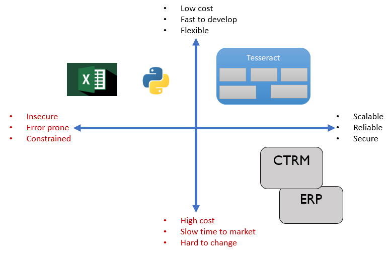
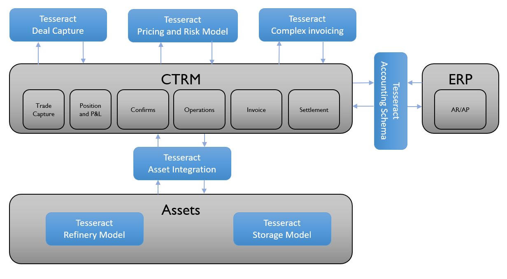

## Tesseract

Open Trading Network have been working on an innovative software platform for the last five years.  The Tesseract platform comes from 30 years of exploring the best way to have low cost, flexible, and quickly delivered solutions which are also able to offer enough security, reliability and scalability to support enterprise operations, audit and control.

Tesseract is a radical approach to building business applications. It's a platform to support modular applications where: the focus is on business logic and models; short cutting the development lifecycle; and avoiding technology being more of a hindrance than a help.

Tesseract is an enterprise solution for flexible, high performant applications built on an in-memory object store and dynamic compilation of types and scripts.

Tesseract takes the concept of a scriptable, extensible data model and builds a system based on this idea. It uses modern, off-the-shelf technologies (e.g. [C#], [Roslyn], [.NET Core], [SQL Server], [Azure], [REST]) to build a lightweight application landscape that allows technical business analysts and developers to quickly build useful, performant applications.

The motivation for Tesseract is to allow developers and analysts to focus on business logic and not system infrastructure.

Tesseract is built on two pillars: 
- The **Object Store**
- And **Type Management and Scripting**

The **Object Store** is an in-memory database of .NET objects with persistence to a SQL database. Objects in the in-memory cache are transactional and a two phase commit scheme ensure integrity between the in memory and the persisted store.

**Type management and Scripting** allows for an extensible data model. Any object held in the store can be modified or extended to meet the business use case.

All changes to types and their instances are audited in the persisted store and the concept of a **Session** gives users access to different versions of types and data at any point in time. The session concept implements *'source control for business data'*. There are a wide variety of use cases for the session concept: what-if scenarios; end-of-month snapshots; hot-fix deployment and testing; etc.

Spanning the two pillars is the **Interface**. The user interface is generated from the types declared in the system, i.e., reports, forms, tools etc. are all rendered from types and there is no requirement for hand-crafting GUI components. The central user interface object is the [View] which provides ways for users to visualise and interact with data in tables and charts. 

All views are automatically exposed as REST APIs with Swagger interactive specifications. The great thing about this approach is that developers can develop and interact with views before developing their REST integrations with the system.

Deployment is managed via PowerShell cmdlets meaning the deployment of changes can be seamlessly integrated with DevOps pipeline.

Lastly, a set of custom web-based deployment tools simplify the definition of types so that technical business analysts can develop applications in the system.

Example use cases for Tesseract...

[Object Store]: todo
[Type Management and Scripting]: todo
[Interface]: todo
[C#]: https://en.wikipedia.org/wiki/C_Sharp_(programming_language)
[Roslyn]: https://en.wikipedia.org/wiki/Roslyn_(compiler)
[.NET Core]: https://en.wikipedia.org/wiki/.NET
[SQL Server]: https://en.wikipedia.org/wiki/Microsoft_SQL_Server
[Azure]: https://en.wikipedia.org/wiki/Microsoft_Azure
[REST]: https://en.wikipedia.org/wiki/Representational_state_transfer