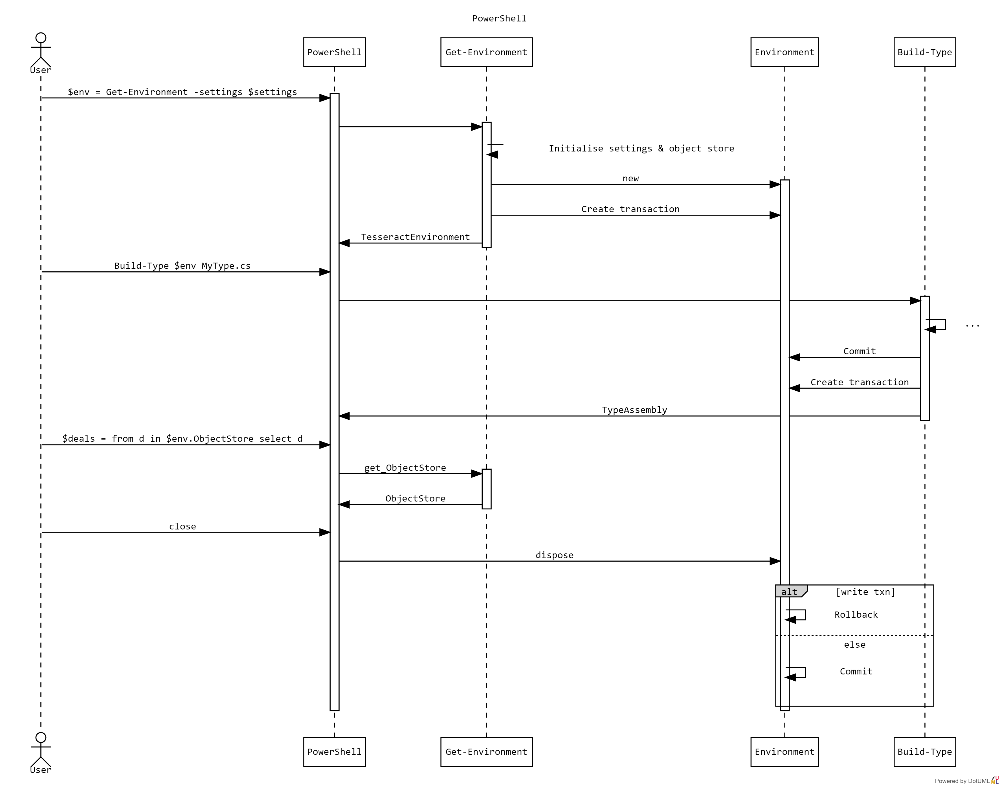

# PowerShell Commands  

Users or DevOPs automation scripts can interact with a Tesseract instance using a set of CmdLets. 

Example:
```
$env = get-environment -URL https://dev1.tesseract.net

or
$appSettings = .\appsettings.json
$settings = get-content $appSettings | convertFrom-json -AsHashTable
$env = get-environment -settings $settings

$t1 = build-type $env PersistedType1_v1.cs
```

The CmdLets are:

#### Enviroment

- ```Get-Environment```: Get a connection to a Tesseract environment - directly or via URL
    - Syntax:
        - ```Get-Environment -URL <string>```
        - ```Get-Environment [-SettingsFile <string>]```
    - Returns: Tesseract Environment
- ```Reset-Environment```: bootstrap a Tesseract database
    - Syntax:
        - ```Reset-Environment [[-Environment] <TesseractEnvironment>]```
    - Returns: Tesseract Environment

#### Types

- ```Build-Type```: compile a type file into a type assembly and update dependent type assemblies
    - Syntax:
        -  ```Build-Type [[-Environment] <TesseractEnvironment>] <string> [-File] <string>```
    - Returns: TypeAssembly definition or compile Exception?
- ```Get-Type```: get all type assemblies or a named type
- ```Install-Type```: install a library containing type definitions and create a type assembly for the primary type
    - Syntax:
        - ```Install-Type -URL <string> [-File] <string> -[Type] <string>```
        - ```Install-Type -Database <string> [-File] <string> -[Type] <string>```
    - Returns: Type Assembly

#### Script

- ```Invoke-Script```: run a script
    - Syntax:
        - ```Install-Types -URL <string> [-Script] <string> [-Build] [-View]```
        - ```Install-Types -Database <string> [-Script] <string> [-Build] [-View]```
    - Returns: ?

#### Sessions

- ```Set-Session```: switches to a session
    - Syntax:
        - ```Set-Session [[-Environment] <TesseractEnvironment>] [-Name] <string>|default ```
    - Returns: Session
- ```New-Session```: switches to or creates a new session? Different commands?
    - Syntax:
        - ```New-Session [[-Environment] <TesseractEnvironment>] [-Name] <string> [[-AsOfDate] <date time>] [-switch]```
    - Returns: Session
- ```Get-Session```: get details about a session or a list of sessions
    - Syntax:
        - ```Get-Session [[-Environment] <TesseractEnvironment>] [-Name] <string>|default```
    - Returns: List of Sessions

#### Transactions

- ```Complete-Transaction```: commit a Tesseract Transaction
    - Syntax:
        - ```Complete-Tesseract```
    - Returns: nothing
- ```Undo-Transaction```: rollback a Tesseract Transaction
    - Syntax:
        - ```Undo-Tesseract```
    - Returns: in verbose mode a list of rolled back items?

### Example interaction - needs rework



### Transactions Examples

1. Explicit commands for complete/undo transaction

```
...
$env = get-environment -settings $settings -autoCommit=false

$t1 = build-type $env PersistedType1_v1.cs

complete-transation
```
