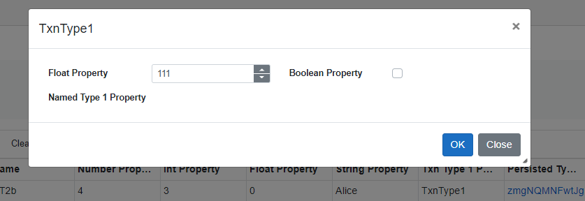

# Transactional Object Editing Notes

## Open and edit XObj from a view edit row
Open and editing XObj from a view edit row, i.e. clock TxnType1 link on the Alice row:


1. Clone and detach XObj1 => XObj1a
2. Popup form with XObj1a as data



3. Change Float Property
4. Press OK

At this point we want to update the edit row's backing store Txn Type 1 Property = XObj1a but not the view item property because the user hasn't chosen to click 'Update' on the row.

It doesn't seem possible to do this so we need to have a dictionary of XObj properties that have been updated then OnRowUpdating we can update and clear this list and on OnRowEditCancel just clear the list.

I.e. in this example the dictionary gets 'TxnType1Property -> XObj1a' on the OK click from the dialog. We can do this in the OnTransactionalObjectFormConfirmed event raised from the dialog. But for context we probably need to round-trip the edit row property name via the FormDialog.Show(...) method. I.e. something like transactionalObjectFormDialog.Show(to.DisplayText, to.GetForm(2), to, "TxnType1Property");

## Open and edit XObj from an XObj itself opened from an edit row
Means cloning and detaching on clicking the edit link.

Need to handle the OnTransactionalObjectFormConfirmed event in the parent form to either set the form property or not.

## Open and edit XObj from an PObj form
Still need to clone/detach, edit and reassign otherwise we can't handle the user changing their mind and cancelling an XObj form edit operation.

## Open and edit XObj from a criteria form


# Alternative Design
Implement in the FormDialog.ItemUpdating(string field, object newValue) event handler a store of previous values and on cancel restore the previous values but don't on OK.

I.e. 

```
    private void OnItemUpdating(string fieldName, object newValue)
    {
        transactionService.InitialiseTransaction();
        var oldValue = viewService.GetObjectProperty(Data, fieldName);
        viewService.SetObjectProperty(Data, fieldName, newValue);

        previousValues[fieldName] = oldValue;
        
    }

    private void OnCancel()
    {
        foreach (var fieldName = previousValues.Keys)
        {
            viewService.SetObjectProperty(Data, fieldName, previousValues[fieldName]);
        }
    }
```

The advantage is this **might** work for all of the above 3 scenarios.

To do this effectively then we want to move the update/cancel buttons and event handling to the FormComponent from the FormDialog:

```
<ModalDialog @ref="modal">
    <Title>@Title</Title>
    <Body>
        <FormComponent Data=@Data Definition=@FormDefinition />
    </Body>
    <Footer>
        <button type="button" class="btn btn-primary" @onclick=@OnConfirm>OK</button>
        <button type="button" class="btn btn-secondary" data-dismiss="modal" @onclick=@OnCancel>Close</button>
    </Footer>
</ModalDialog>
```

or capture a reference to the FormComponent and call a reset method on it from the modal dialog?

